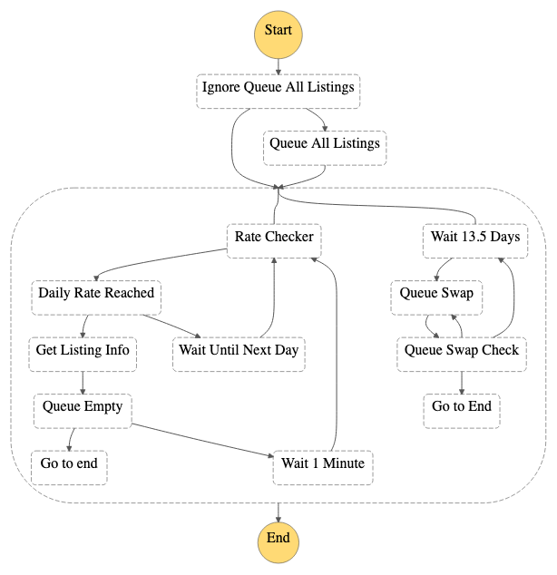

# Data Retrieval Phase

## get_listings
Retrieves data from alphavantage and stores in S3 bucket

## get_listings_info
Retrieves data from alphavantage for a specific symbol

## rate_checker
A utility script that helps check rate request limit for alpha vantage

## queue_all_listings
Sends messages to a queue for the get listings info to read from

## queue_swap
*Deprecated*
Swaps queue messages to avoid message retention limit

## Future Tasks
* Containers instead of zips?
* Deployment pipeline
* Localstack testing